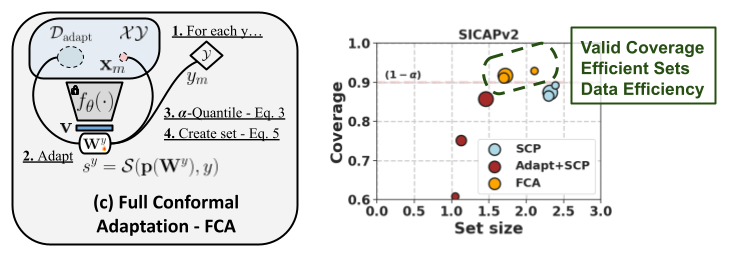

# Full Conformal Adaptation of Medical VLMs

 <br/>

The official implementation of [*Full Conformal Adaptation of Medical Vision-Language Models*]().<br/>
📜 <span style="color:red">*Oral presentation at the Int. Conference on Information Processing in Medical Imaging*</span> \
[Julio Silva-Rodríguez<sup>1</sup>](https://scholar.google.es/citations?user=1UMYgHMAAAAJ&hl),
[Leo Fillioux<sup>2</sup>](https://scholar.google.fr/citations?user=c0kBPnoAAAAJ&hl),
[Paul-Henry Cournède<sup>2</sup>](https://scholar.google.fr/citations?user=LGr1sroAAAAJ&hl),
[Maria Vakalopoulou<sup>2</sup>](https://scholar.google.gr/citations?user=FKUHYqMAAAAJ&hl), <br/>
[Stergios Christodoulidis<sup>2</sup>](https://scholar.google.com/citations?user=-h5w30sAAAAJ&hl), 
[Ismail Ben Ayed<sup>1</sup>](https://scholar.google.es/citations?user=29vyUccAAAAJ&hl),
[Jose Dolz<sup>1</sup>](https://scholar.google.es/citations?user=yHQIFFMAAAAJ&hl) <br/>
<sup>1</sup>ÉTS Montréal ⋅ <sup>2</sup>CentraleSupélec, Université Paris-Saclay <br/>
| [Project](https://jusiro.github.io/projects/fca) | [Conference]() | [ArXiv]() | [Code](https://github.com/jusiro/FCA) |
<br/>


### Install

* Install in your environment a compatible torch version with your GPU. For example:

```
conda create -n fcaenv python=3.11 -y
conda activate fcaenv
pip install torch==2.6.0 torchvision==0.21.0 torchaudio==2.6.0 --index-url https://download.pytorch.org/whl/cu124
```

```
git clone https://github.com/jusiro/FCA.git
cd FCA
pip install -r requirements.txt
```

### Preparing the datasets
- Configure data paths (see [`./local_data/constants.py`](./local_data/constants.py)).
- Download, and configure datasets (see [`./local_data/datasets/README.md`](./local_data/datasets/README.md)).

## Usage
We present the basic usage here.

(a) Features extraction:
- `python extract_features.py --task Gleason,MESSIDOR`

(b) Spit conformal prediction (SCP):
- `python scp.py --task Gleason,MESSIDOR --k 16 --alpha 0.10 --ncscore lac`

(c) Full conformal adaptation (FCA):
- `python scpt.py --task Gleason,MESSIDOR --k 16 --alpha 0.10 --ncscore lac`

You will find the results upon training at [`./local_data/results/`](./local_data/results/).


## Citation

If you find this repository useful, please consider citing this paper:
```
@inproceedings{fca25,
    title={Full Conformal Adaptation of Medical Vision-Language Models},
    author={Julio Silva-Rodr\'iguez and Leo Fillioux and Paul-Henry Cournède and Maria Vakalopoulou and
    Stergios Christodoulidis and Ismail {Ben Ayed} and Jose Dolz},
    booktitle={Information Processing in Medical Imaging (IPMI)},
    year={2025}
}
```


